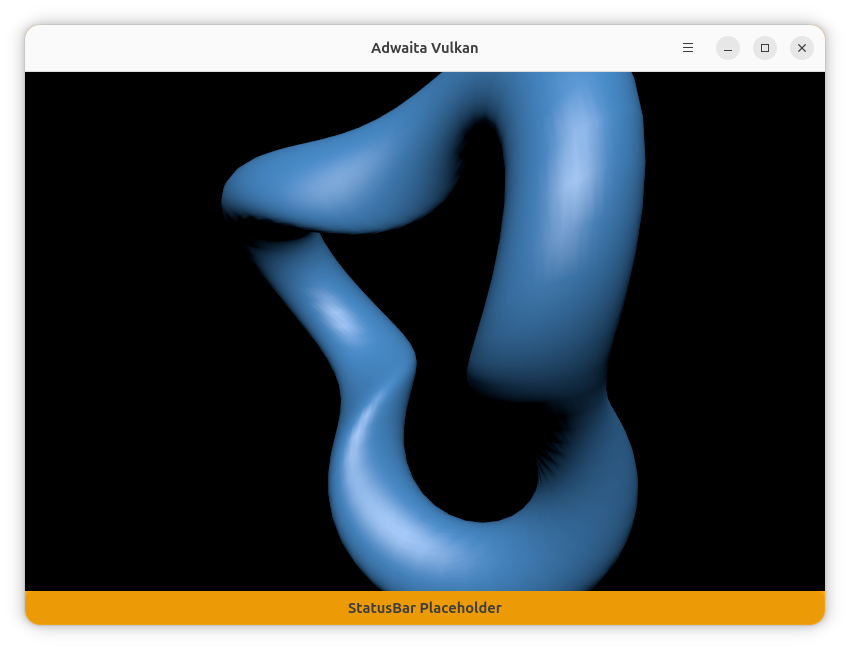

# mini-vulkan Gtk4/Adwaita/Vulkan 

## Description

A small demonstration App showing how to initialize a private Vulkan context.
It is an adaptation of one of the [The Khronos Vulkan® Tutorial](https://docs.vulkan.org/tutorial/latest/00_Introduction.html) 
programs into the Gtk4/Adwaita Toolkit (from GLFW).  
Changes: procedural geometry + arcball



## Dependencies
 
Linux/Wayland  
Vulkan  
gtk4  
adwaita  
glm  
wayland-client  

ex. Ubuntu 26.04  

```bash
apt install libadwaita-1-dev libglm-dev libwayland-dev libvulkan-dev
```

## Build and Run

```bash
git clone https://github.com/marcin-sosna20/mini-vulkan.git
cd mini-vulkan
meson setup _build
ninja -C _build
./_build/src/app
```

## Acknowledgments

- **[The Khronos Vulkan® Tutorial](https://docs.vulkan.org/tutorial/latest/00_Introduction.html)** - 
- **[Vulkan Tutorial by Alexander Overvoorde](https://vulkan-tutorial.com/)** -

## Copying
Licensed under the permissive [MIT license](COPYING).
Project also includes code and assets licensed under:
[CC0 1.0 Universal](https://creativecommons.org/publicdomain/zero/1.0/) 
